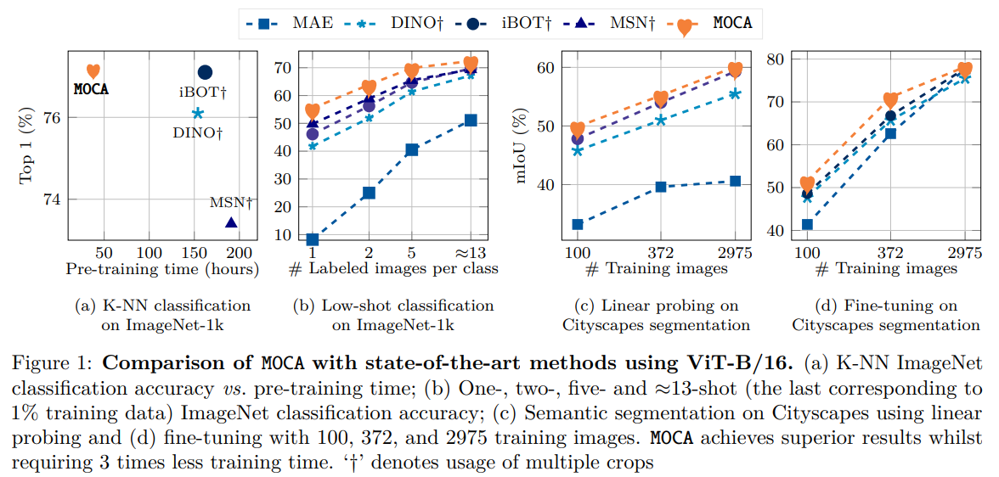

# **MOCA: Self-supervised Representation Learning by Predicting Masked Online Codebook Assignments**

## [Paper (TMLR)](https://openreview.net/forum?id=OdDsCaacZ0) | [Paper (arXiv)](https://arxiv.org/abs/2307.09361) | [Pretrained full model](https://github.com/valeoai/MOCA/releases/download/v1.0.0/moca_vitb16_200epochs_mom994_wd05to20_v1p0.pth)
[Spyros Gidaris](https://scholar.google.fr/citations?user=7atfg7EAAAAJ&hl=en),
[Andrei Bursuc](https://abursuc.github.io/),
[Oriane Simeoni](https://osimeoni.github.io/),
[Antonin Vobecky](https://vobecant.github.io/),
[Nikos Komodakis](https://www.csd.uoc.gr/~komod/),
[Matthieu Cord](http://webia.lip6.fr/~cord/),
[Patrick Pérez](https://ptrckprz.github.io/),

Official PyTorch implementation of the [MOCA](https://openreview.net/forum?id=OdDsCaacZ0) paper accepted at TMLR 2024

MOCA is a self-supervised pretraining method for Vision Transformers (ViT) that combines masked-image-modeling and self-distillation objectives using high-level features in a novel mask-and-predict task. Doing so, it achieves state-of-the-art results in low-shot settings and strong performance in various evaluation protocols, while being at least 3 times faster to train than previous methods.



If you use the MOCA code in your research, please consider citing:

```
@article{gidaris2024moca,
  title={{MOCA}: Self-supervised Representation Learning by Predicting Masked Online Codebook Assignments},
  author={Spyros Gidaris and Andrei Bursuc and Oriane Sim{\'e}oni and Anton{\'\i}n Vobeck{\'y} and Nikos Komodakis and Matthieu Cord and Patrick Perez},
  journal={Transactions on Machine Learning Research},
  issn={2835-8856},
  year={2024},
  url={https://openreview.net/forum?id=OdDsCaacZ0},
  note={}
}
```

## Overview

- [Download pretrained models](#download)
- [Pretraining](#pretraining)
- [Evaluation](#evaluation)
- [Acknowledgements](#acknowledgements)
- [LICENCE](#license)

## Download pretrained models <a name="download"></a>

The available pretrained ViT-B/16 MOCA models are:

| Model          | Arch | Epochs | Momemtum         | Weight decay    | Dataset     |  k-NN    | Linear probing | Finetuning |
|----------------|------|--------|------------------| ----------------| ------------|---------|----------------|--------|        
| [MOCA-v0.9](https://github.com/valeoai/MOCA/releases/download/v1.0.0/moca_vitb16_200epochs_mom99_wd05_v0p9.pth)  | ViT-B/16 | 200    | 0.990 --> 1.0     | 0.05 (constant) | ImageNet-1k  | 77.2    | 78.7          | 83.6   |
| [MOCA-v1.0](https://github.com/valeoai/MOCA/releases/download/v1.0.0/moca_vitb16_200epochs_mom994_wd05to20_v1p0.pth)  | ViT-B/16 | 200    | 0.994 --> 1.0    | 0.05 --> 0.20   | ImageNet-1k  | 77.4    | 79.5          | 83.6   |

**NOTES:** The results for k-NN, Linear Probing, and Finetuning presented above are based on the ImageNet-1k benchmark. [MOCA-v0.9]() is the pretrained MOCA model used on the [TMLR paper](https://openreview.net/forum?id=OdDsCaacZ0), while [MOCA-v1.0]() is the reproduced MOCA model with the released code (i.e., after cleaning the code) plus slightly-better tuned teacher momentum and weight decay. The performance of both these MOCA models on the ImageNet-1k low-shot classification settings is as follows:

| Model          | Arch | 1-shot | 2-shot | 5-shot | 1% setting |
|----------------|------|--------|--------|--------|------------|         
| [MOCA-v0.9](https://github.com/valeoai/MOCA/releases/download/v1.0.0/moca_vitb16_200epochs_mom99_wd05_v0p9.pth)  | ViT-B/16 | 55.4   | 63.9   | 69.9   | 72.4   |
| [MOCA-v1.0](https://github.com/valeoai/MOCA/releases/download/v1.0.0/moca_vitb16_200epochs_mom994_wd05to20_v1p0.pth)  | ViT-B/16 | 55.2   | 63.9   | 69.7   | 72.4   |

## Pretraining <a name="pretraining"></a>
Pretrain a ViT-B/16 MOCA model
```bash
DATA_PATH="path_to_ImageNet1k"
OUTPUT_DUMP="moca_vitb16_200epochs_mom994_wd05to20_v1p0"
torchrun --standalone --nnodes=1 --nproc_per_node=8 main_pretrain.py \
  --output_dir "${OUTPUT_DUMP}" --data_path "${DATA_PATH}" --model moca_vit_base_patch16_dec2 \
  --accum_iter 1 --batch_size 256 --num_workers 8 \
  --max_epochs 200 --warmup_epochs 30 --lr_epochs_mul 1.25 --blr 1.5e-4 --weight_decay 0.05 --weight_decay_end 0.20 --alpha 0.994
```

Alternatively, you can download the pretrained MOCA model with
```bash
$ mkdir moca_vitb16_200epochs_mom994_wd05to20_v1p0
$ cd moca_vitb16_200epochs_mom994_wd05to20_v1p0
$ wget https://github.com/valeoai/MOCA/releases/download/v1.0.0/moca_vitb16_200epochs_mom994_wd05to20_v1p0.pth
$ ln -s moca_vitb16_200epochs_mom994_wd05to20_v1p0.pth checkpoint-last.pth
$ cd ../../
```

You can use the following code to extract only the teacher encoder from a pretrained MOCA model, allowing you to use it as a feature extractor:
```bash
PRETRAINED_DIR="moca_vitb16_200epochs_mom994_wd05to20_v1p0"
python util/extract_teacher_from_checkpoint.py --checkpoint="${PRETRAINED_DIR}/checkpoint-last.pth" --dst="${PRETRAINED_DIR}/teacher-last.pth"
```

## Evaluation <a name="evaluation"></a>

### Evaluation on ImageNet k-NN classification
```bash
DATA_PATH="path_to_ImageNet1k"
PRETRAINED_DIR="moca_vitb16_200epochs_mom994_wd05to20_v1p0"

python -m torch.distributed.launch --nproc_per_node=8 --use_env eval_knn.py \
  --data_path "${DATA_PATH}" --batch_size 250 --num_workers 8 --arch vit_base_patch16 \
  --eval_teacher --pretrained_weights "${PRETRAINED_DIR}/checkpoint-last.pth"
# Expected results:
# k-NN classification with T=0.04.
# 10-NN classifier result: Top1: 77.472, Top5: 89.686
# 20-NN classifier result: Top1: 77.446, Top5: 91.064
```

### Evaluation on ImageNet classifcation with linear probing
```bash
DATA_PATH="path_to_ImageNet1k"
PRETRAINED_DIR="moca_vitb16_200epochs_mom994_wd05to20_v1p0"
OUTPUT_DUMP="${PRETRAINED_DIR}/LINEAR_CLSnAVG"
MODEL_PATH="${PRETRAINED_DIR}/checkpoint-last.pth"

# Training a linear classifier on the image feature constracted by concatenating the [CLS] token embedding and the [AVG] token embedding (i.e., average pooling of the patch token embeddings).
both the [AVG] token (i.e., the global average of the p)
torchrun --standalone --nnodes=1 --nproc_per_node=8 eval_linear.py \
  --data_path "${DATA_PATH}" --pretrained_weights "${MODEL_PATH}" --output_dir "${OUTPUT_DUMP}" \
  --batch_size 128 --num_workers 8 --arch "vit_base_patch16" --eval_teacher --avgpool_patchtokens 2
# Expected results:
# Top-1 test accuracy: 79.5

# Training a linear classifier on [AVG] token embedding (i.e., embedding computed by average pooling of the patch token embeddings).
OUTPUT_DUMP="${PRETRAINED_DIR}/LINEAR_AVG"
torchrun --standalone --nnodes=1 --nproc_per_node=8 eval_linear.py \
  --data_path "${DATA_PATH}" --pretrained_weights "${MODEL_PATH}" --output_dir "${OUTPUT_DUMP}" \
  --batch_size 128 --num_workers 8 --arch "vit_base_patch16" --eval_teacher --avgpool_patchtokens 1
# Expected results:
# Top-1 test accuracy: 79.2
```

## Evaluation on ImageNet classifcation with full finetuning
```bash
DATA_PATH="path_to_ImageNet1k"
PRETRAINED_DIR="moca_vitb16_200epochs_mom994_wd05to20_v1p0"
OUTPUT_DUMP="${PRETRAINED_DIR}/FTUNE_lr1p0e3_dp0p2_ld065_wu5"
MODEL_PATH="${PRETRAINED_DIR}/checkpoint-last.pth"

torchrun --standalone --nnodes=1 --nproc_per_node=8 eval_finetune.py \
        --data_path "${DATA_PATH}" --finetune "${MODEL_PATH}" --output_dir "${OUTPUT_DUMP}" \
        --accum_iter 1 --batch_size 128 --num_workers 8 --model vit_base_patch16 --dist_eval --use_teacher \
        --global_pool --use_fc_norm --drop_path 0.2 --blr 1.0e-3 --layer_decay 0.65 --warmup_epochs 5 --epochs 100 \
        --reprob 0.25 --mixup 0.8 --cutmix 1.0 --weight_decay 0.05
# Expected results:
# Acc@1 83.574 Acc@5 96.602 loss 0.725

torchrun --standalone --nnodes=1 --nproc_per_node=8 eval_finetune.py \
        --data_path "${DATA_PATH}" --finetune "${MODEL_PATH}" --output_dir "${OUTPUT_DUMP}" \
        --accum_iter 1 --batch_size 128 --num_workers 8 --model vit_base_patch16 --use_teacher \
        --global_pool --use_fc_norm --drop_path 0.2 --blr 1.0e-3 --layer_decay 0.65 --warmup_epochs 5 --epochs 100 \
        --reprob 0.25 --mixup 0.8 --cutmix 1.0 --weight_decay 0.05 --eval \
        --resume "${OUTPUT_DUMP}/checkpoint-last.pth"
```

## Evaluation on Low-shot ImageNet classification
Go to [README_LOWSHOT_LINEAR.md](./README_LOWSHOT.md)


## Acknowledgements

Part of the code has been adapted from [MAE](https://github.com/facebookresearch/mae) (CC-BY-NC 4.0 license), [iBOT](https://github.com/bytedance/ibot) (linear probing part; Apache 2.0 license), [MSN](https://github.com/facebookresearch/msn) (low-shot evaluation with logistic regression; Attribution-NonCommercial 4.0 International licence), and [DINO](https://github.com/facebookresearch/dino) (kNN evaluation; Apache 2.0 license). These projects in turn have utilized code from [DEIT](https://github.com/facebookresearch/deit), [BEIT](https://github.com/microsoft/unilm/tree/master/beit), [MoCov3](https://github.com/facebookresearch/moco-v3), and [ELECTRA](https://github.com/google-research/electra). Additionally, in our work we make use of the [timm](https://github.com/huggingface/pytorch-image-models) library. We thank the authors of these works and frameworks for making them open-source.

## License
MOCA is released under the [Apache 2.0 license](./LICENSE).
